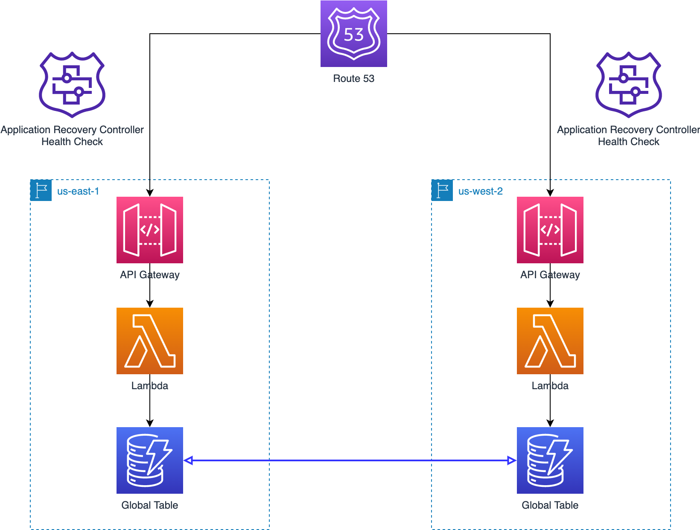
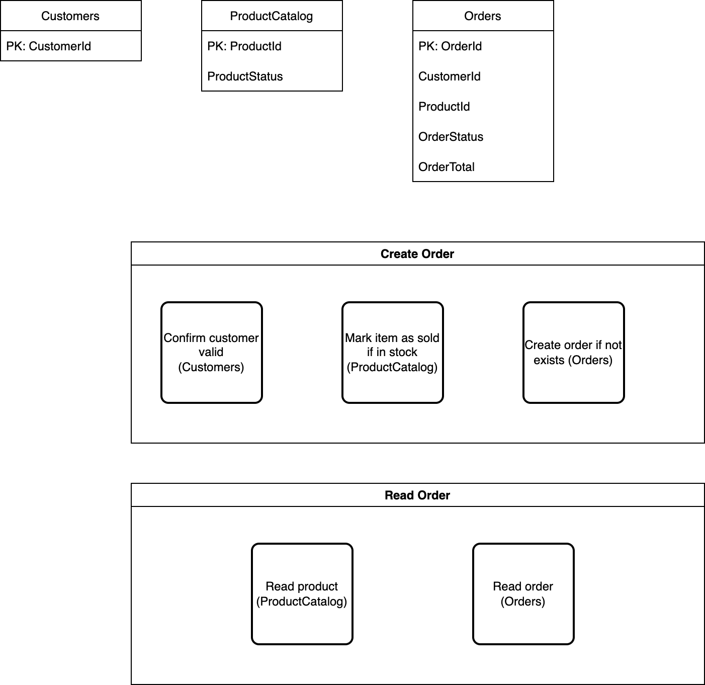
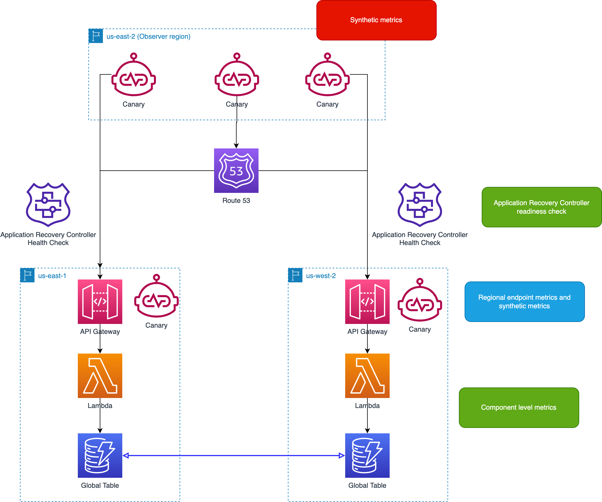

# Guidance for Resilient Data Applications using Amazon DynamoDB

## Table of Content

1. [Overview](#overview-required)
    - [Organization](#organization)
    - [Architecture](#architecture)    
    - [Cost](#cost)
2. [Prerequisites](#prerequisites)
    - [Operating System](#operating-system)
3. [Deployment Steps](#deployment-steps)
4. [Deployment Validation](#deployment-validation)
5. [Running the Guidance](#running-the-guidance)
6. [Next Steps](#next-steps)
7. [Cleanup](#cleanup)

## Overview

This repository has sample code demonstrating how to build a resilient multi-region application with DynamoDB Global Tables as the data store.

We aim to demonstrate the basic building blocks of a simple multi-region application designed for high levels of resilience.  The architecture is robust, but it does not include production levels of observability, focusing instead only on the most interesting metrics.  In terms of the Well-Architected Framework:

* Operational Excellence.  The design benefits from heavy use of serverless technology, which reduces operational overhead.  It touches on, but does not fully explore, the use of runbooks and chaos engineering to test resilience.  
* Security.  The architecture uses properly scoped security policies at the infrastructure level.  However, it doesn't consider the separation of duties of developers versus operations teams, or provide multiple environments for testing purposes.  It uses default encryption options where applicable.
* Reliability.  The architecture focuses mostly on this pillar.  The application is deployed into two regions with a highly resilient failover control.  The use of serverless technologies takes away some of the concern about reliability under heavy load, although more could be done in the area of load shedding and other protections.
* Performance Efficiency.  Deploying the application into two regions helps with performance for a distributed user base, which is often a secondary goal of multi-region patterns.  The included observability metrics also focus on some aspects of the user experience in a distributed environment.
* Cost Optimization.  The application benefits from using serverless technologies that meter primarily based on usage.  With the exception of the failover routing controls, there is little fixed cost in the design.
* Sustainability.  Using serverless technologies benefits this pillar as well, in the sense that we have few always-on resources consuming energy.  

In the rest of this repository, we'll try to point out areas for improvement that fall outside the scope of the sample code.

### Organization 

This repository uses CloudFormation as the deployment mechanism for two reasons.  First, CloudFormation is simple to use and available to every AWS user.  Second, some of the supporting AWS services we use, like Resilience Hub, can easily work with CloudFormation.

However, if you were building a production application, you would likely use a CI/CD deployment pipeline.  There are many good choices for multi-region deployment pipelines, including [Code Pipeline](https://docs.aws.amazon.com/prescriptive-guidance/latest/patterns/deploy-code-in-multiple-aws-regions-using-aws-codepipeline-aws-codecommit-and-aws-codebuild.html) and open-source solutions like Spinnaker.  The pipeline could include security scanning, unit testing, and other useful steps outside the scope of this example.  You might also choose to use a different infrastructure-as-code solution.  The CDK lets you replace a lot of boilerplate CloudFormation template code with simple declarative programming.  

The repository is built around three main modules:

* CloudFormation templates to deploy the application itself into two regions.
* CloudFormation templates to deply Route 53 Application Recovery Controller (ARC) for mult-region routing and failover.
* CloudFormation template to deploy a simple serverless testing program into two regions.

### Architecture

The basic application has a simple design.  It consists of an API Gateway, Lambda functions that implement RESTful API methods, and a set of DynamoDB Global Tables for persistence.  Route 53 provides cross-region routing, and Application Recovery Controller inserts routing controls that we can use to shut off traffic to a region if necessary.

The schema has three tables that store customers, products, and orders.  The REST API has methods to create and read orders, and also to populate the database with sample data.

We also deploy CloudWatch Synthetics canaries in both application regions and in a third observer region.

### Cost

You are responsible for the cost of the AWS services used while running this Guidance. As of May 2024, the cost for running this Guidance with the default settings in the US East (N. Virginia) AWS Region is approximately $2059 per month. 

The most significant cost for this sample comes from the ARC control plane, which will cost $2.50 per hour or $60 per day.  The CloudWatch canaries will cost $0.36 per hour or about $8.70 per day.

The API Gateway, Lambda, and DynamoDB resources used will often fall within the free tier, as these services are metered in the millions of requests.

We recommend creating a [Budget](https://docs.aws.amazon.com/cost-management/latest/userguide/budgets-managing-costs.html) through [AWS Cost Explorer](https://aws.amazon.com/aws-cost-management/aws-cost-explorer/) to help manage costs. Prices are subject to change. For full details, refer to the pricing webpage for each AWS service used in this Guidance.

### Sample Cost Table

The following table provides a sample cost breakdown for deploying this Guidance with the default parameters in the US East (N. Virginia) Region for one month.

| AWS service  | Dimensions | Cost [USD] |
| ----------- | ------------ | ------------ |
| Amazon Route53 | 1 Application Recovery Controller (ARC) cluster  | $1800 month |
| Amazon CloudWatch | 5 canaries running every minute | $ 259 month |

## Prerequisites

### Operating System

This guidance is deployed and run from within an AWS Account using an Amazon Linux 2 compatible environment like [CloudShell](https://aws.amazon.com/cloudshell/) or [Cloud9](https://aws.amazon.com/cloud9/).

### AWS account requirements

You need a hosted zone registered in Amazon Route 53. This is used for defining the domain name of your API endpoint, for example, helloworldapi.replacewithyourcompanyname.com. You can use a third-party domain name registrar and then configure the DNS in Amazon Route 53, or you can purchase a domain directly from Amazon Route 53.

The instructions use the AWS CLI rather than the console for consistency.  The console changes frequently and screenshots are usually out of date within weeks, whereas the CLI is stable. 

You will need an AWS account and access to an Amazon Linux 2 compatible environment ([CloudShell](https://aws.amazon.com/cloudshell/) or [Cloud9](https://aws.amazon.com/cloud9/) are both AWS native ways to achive this) with permission to create resources in several AWS services:

- DynamoDB
- IAM
- Lambda
- API Gateway
- Route 53
- S3

## Deployment Steps 

Going forward, we will refer to inputs you need to provide in `ALL CAPS`.  This will include the names of S3 buckets and your domain name.

We'll build out the application in several stages, starting with deploying the application into each region, and then adding multi-region routing and a test program.

### Region Selection

You need to pick two AWS regions to use.  The CloudFormation templates provide `us-east-1`, `us-east-2`, `us-west-2`, and `eu-west-1` as options.  However, any AWS region that supports the services used in this example should work.  

You'll also pick a third region to use for synthetic monitoring.

Going forward, we'll refer to these regions as `REGION1` and `REGION2` and `REGION3`.

Make sure that you set up the AWS CLI, and add a profile for each region.  Activate the profile for `REGION1`.

### Bootstrapping

#### S3

We need to create an S3 bucket in each region.  We'll use S3 server-side encryption (SSE) and versioning.  You'll need to choose the names of the buckets, which we'll refer to as `BUCKET1` and `BUCKET2` and `BUCKET3`.

For convenience, we've provided a script that creates buckets.  Execute these commands:

    python ./scripts/make_bucket.py --name BUCKET1 --region REGION1
    python ./scripts/make_bucket.py --name BUCKET2 --region REGION2
    python ./scripts/make_bucket.py --name BUCKET3 --region REGION3

#### Test suite

Upload the test-suite script to each bucket.

    mkdir test-suite
    cd test-suite
    pip3 install requests boto3 botocore awscrt -t .
    cp ../test/test-suite-*.py .
    zip -r test-suite.zip *
    cd ..

    aws s3 cp test-suite/test-suite.zip s3://BUCKET1/lambda/test-suite.zip
    aws s3 cp test-suite/test-suite.zip s3://BUCKET2/lambda/test-suite.zip   

#### Canary script

Upload the canary script to each bucket.

    mkdir canary
    cd canary
    pip3 install botocore awscrt -t ./python
    cp ../test/canary.py ./python
    zip -r canary.zip python
    cd ..

    aws s3 cp canary/canary.zip s3://BUCKET1/canary/canary.zip
    aws s3 cp canary/canary.zip s3://BUCKET2/canary/canary.zip
    aws s3 cp canary/canary.zip s3://BUCKET3/canary/canary.zip

### Manual test scripts

Install dependencies locally

    pip3 install boto3 botocore awscrt

### Deploy application in first region

You can choose any name for the CloudFormation stack.  We'll refer to this as `STACK`, and for simplicity we'll use the same name in both regions.

We'll refer to your domain name as `DOMAIN`.

Next, deploy the CloudFormation template for the basic application stack in the first region:

    ./scripts/create.sh \
        STACK \
        BUCKET1 \
        REGION1 \
        REGION1 \
        REGION2 \
        DOMAIN

Wait for this stack to complete before moving on.

### Deploy application in second region

    ./scripts/create.sh \
        STACK \
        BUCKET2 \
        REGION2 \
        REGION1 \
        REGION1 \
        DOMAIN 

Wait for this stack to complete before moving on.

### Updating the applications

If you need to update either stack, simply re-run the `create.sh` script with the `--update` argument as the last option.

If you update the Lambda functions in the stacks after the initial deployment, you'll need to redeploy the API Gateway stage manually.

### Test the deployment

The CloudFormation stacks output several useful pieces of information.  You can obtain these by running:

    aws cloudformation describe-stacks --stack-name STACK --region REGION1 | jq -r '.Stacks[0].Outputs[]'
    aws cloudformation describe-stacks --stack-name STACK --region REGION2 | jq -r '.Stacks[0].Outputs[]'

Now you can execute several of the included scripts to test that the application is working in both regions. For each script, select either `ApiUrl` from the commands above to test the region.

The first script populates the tables with example customers and products. Execute this method and take note of the output, which includes the customer and product IDs.

    python3 ./test/r1-fill.py APIURL

Once you have sample customers and products, execute this method to create an order.  Set the parameter `customerId` to one of the customer IDs created in the previous method, and set the `productId` parameter to one of the example product IDs.  Set the `orderId` to any unique value.

    python3 ./test/r1-create.py APIURL CSUSTOMERID PRODUCTID ORDERID

You can now retrieve the order you just made.  Set the parameters `orderId` and `productId` to the values you used in the previous method.

    python3 ./test/r1-read.py APIURL ORDERID PRODUCTID

Try retrieving the order again, but use the alternative `ApiUrl`. You can see that the order has been replicated across regions.

### Set up global routing

Now we'll run three scripts to configure DNS and the ARC health check.  We pass in the name of the application stack as these scripts interrogate the output values.  For the final script, we also pass in our domain name and hosted zone ID.  You can find the hosted zone ID by running:

    aws route53 list-hosted-zones

Look for the hosted zone that aligns to your domain name, and look for the ID.  The ID is of the form:

    /hostedzone/<hosted zone ID>

Once you have this information, run:

    cd r53/scripts
    ./Route53-create-readiness-check.sh STACK REGION1

Wait for this stack to complete before moving on.

    ./Route53-create-routing-controls.sh STACK REGION1

Wait for this stack to complete before moving on.

    ./Route53-create-dns-records.sh STACK DOMAIN HOSTED_ZONE_ID REGION1

Wait for this stack to complete before moving on.

The DNS methodology for API Gateway is based on this [blog](https://aws.amazon.com/blogs/compute/building-a-multi-region-serverless-application-with-amazon-api-gateway-and-aws-lambda/), and requires that you own a domain registered in Route 53.

The routing controls are off by default.  We'll turn them on using the CLI.  While you can use the console, it's more reliable to use one of the five regional endpoints instead.  That way, you can still change the state of the routing controls even if one region is offline.

In the next command we'll need the `ClusterArn` and `ControlPanelArn` outputs of the stack called `Route53ARC-RoutingControl`.  You can retrieve these by running:

    aws cloudformation describe-stacks --stack-name Route53ARC-RoutingControl --region us-west-2 | jq -r '.Stacks[0].Outputs[]'

Now we can run:

    aws route53-recovery-control-config describe-cluster --region us-west-2 --cluster-arn <cluster ARN>

Note the five endpoints listed in the output.  Pick any one and now run:

    aws route53-recovery-cluster list-routing-controls --control-panel-arn <control panel ARN> --region <endpoint region> --endpoint-url <endpoint URL>

On initial deployment, both routing controls are off.  Let's turn them on:

    aws route53-recovery-cluster update-routing-control-states \
				--update-routing-control-state-entries \
				'[{"RoutingControlArn": "<routing control ARN from previous output>", "RoutingControlState": "On"},
				{"RoutingControlArn": "<second routing control ARN from previous output>", "RoutingControlState": "On"}]' \
				--region <endpoint region> \
				--endpoint-url <endpoint URL>

### Test the Route 53 endpoint

Now you can use the scripts to test the endpoints via your DOMAIN. Prefix your DOMAIN with `https://` and suffix with `/v1` to create DOMAIN_URL. For example, if your DOMAIN was `helloworldapi.replacewithyourcompanyname.com`, DOMAIN_URL would be `https://helloworldapi.replacewithyourcompanyname.com/v1`
    
    python3 ./test/r1-fill.py DOMAIN_URL

    python3 ./test/r1-create.py DOMAIN_URL CSUSTOMERID PRODUCTID ORDERID

    python3 ./test/r1-read.py DOMAIN_URL ORDERID PRODUCTID

Route53 is directing requests to either REGION1 or REGION2 for processing.

### Dashboard

There's a canned CloudWatch dashboard called `DynamoDB-Metrics-<region name>` available in both regions.  The dashboard has charts showing replication latency, operation latency, observed client latency, and request counts.  We'll use these dashboards later on to evaluate the results of some testing.  You will not see data in this dashboard until you start sending traffic into the API endpoints.

### Synthetics

We can now deploy the canary in both application regions and the observer region.  In the following arguments, you can retrieve the regional API names from the CloudFormation output called `ApiId` from the application stack in each region.  The `productId` and `orderId` arguments should be an existing order ID and the associated product ID.  The canaries use these to execute a `GET` operation for an order.  In a more realistic example, you might have a dedicated health check method in the application, or a dedicated test data set.  Finally, the last argument is your personal domain name followed by `/v1`, e.g. `helloworldapi.replacewithyourcompanyname.com/v1`.

    ./scripts/create-canaries.sh \
        BUCKET1 \
        BUCKET2 \
        BUCKET3 \
        REGION1 \
        REGION2 \
        REGION3 \
        <api name in first region> \
        <api name in second region> \
        <api stage name> \
        <sample product ID> \
        <sample order ID> \
        DOMAIN/v1

Wait for this stack to complete before moving on.

### Deploying test application

We'll now deploy a simple testing application that can invoke our API endpoints.  Choose a stack name, then run:

    ./scripts/create-test-suite.sh \
        BUCKET1 \
        BUCKET2 \
        TEST_STACK_NAME \
        REGION1 \
        REGION2 

Wait for this stack to complete before moving on.

## Deployment Validation

To validate everything has deployed successfully, check all of the CloudFormation stacks you deployed from the previous steps in each of your selected regions. All stacks should have a status of *Enabled*.

## Running the Guidance 

### Measuring latency and failover time

To begin, we'll use the test application to generate some orders.  The test application will first create some example customers and products, then execute at most one order at a time, with a one second interval before executing another one.  It's meant to emulate a low but steady rate of requests coming in to both regions.  

Run this helper script to invoke the test application in both regions.  

    ./scripts/run-test.sh \
        TEST_STACK_NAME \
        REGION1 \
        REGION2 \
        DOMAIN \
        600 \
        300 \
        <ARC endpoint region> \
        <ARC endpoint URL> \
        <routing control ARN for first region from previous ARC output> \
        <routing control ARN for second region from previous ARC output>

The script will print out the approximately time the test began in both regions.  It will then sleep for a time interval of 5 minutes before switching the routing control in one region to `OFF`.

By executing 600 orders, we're making sure that the order flow continues for at least 10 minutes.  That gives us time to use ARC to disable traffic to one region, and measure how long it takes traffic to fail over.

After the test is over, open the CloudWatch dashboard for each region.  Zoom in to the past 30 minutes and observe:

* The time to failover is about one minute.  We look at the `RequestCounts` chart and note that requests in the region where the routing control is off started to direct to another region.  This is approximately the RTO for clients who need to switch endpoints.
* Replication latency for orders is between 600-1200 ms.  This is approximately the RPO.
* Operation latency is about 5-20 ms in the same region.

## Next Steps

To incorporate the features this guidance has demonstrated into your own applications, consider

1. adding synthetic checks to your own application
2. adding Application Recovery Controller (ARC) to your multi-region applications to control routing and failover

## Cleanup

In order to clean up the resources deployed by this sample, you must delete all of the CloudFormation stacks created in the three regions.

* Observability region: Delete the stack that deployed the canaries.
* Second region
    * Delete the canary stack
    * Delete the test stack
    * Delete the application stack
* First region
    * Delete the canary stack
    * Delete the test stack
    * Delete the Route 53 ARC stacks
    * Delete the application stack

## FAQ, known issues, additional considerations, and limitations

**Known issues **

`botocore.crt has no method named 'auth'`
When installing `awscrt` via pip, the version that is installed must match the architecture and Python version of the environment that it will run in. This error occurs when there is a version mismatch.

## Security

See [CONTRIBUTING](CONTRIBUTING.md#security-issue-notifications) for more information.

## License

This library is licensed under the MIT-0 License. See the LICENSE file.
